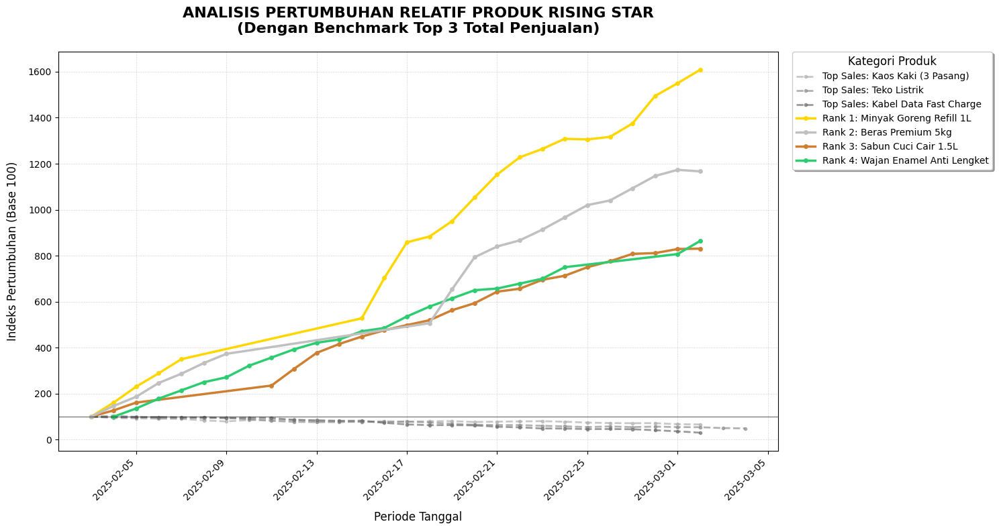
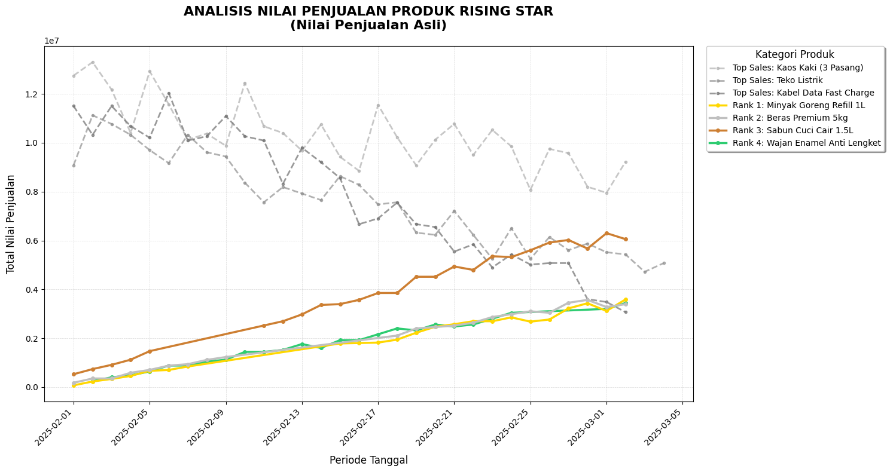

# Retail Performance Analytics & Market Basket Mining
### 🚀 DQLab Python Hackathon 2026 | Original Score: 84.45/100 | Post-Correction Score: 100/100

This repository contains my solution for the **DQLab Python Hackathon 2026**. The project focuses on solving a real-world retail business challenge: converting raw transaction data into strategic recommendations by identifying high-growth products (**"Rising Stars"**) and designing optimized product bundles (**"Potential Packaging"**) to boost revenue.

---

## 📌 Project Overview
In retail, identifying sales trends and product purchase associations is critical for inventory management and cross-selling. This pipeline processes thousands of transaction invoices to:
1. **Identify "Rising Star" Products:** Products showing consecutive growth streaks over a specific period.
2. **Generate "Potential Packaging":** Bundles of products that are frequently bought together, specifically linking Rising Star products with associated goods to drive cross-selling.
3. **Export Reports & Charts:** Output clean, multi-sheet Excel reports and high-DPI visualizations for business decision-makers.

---

## 📊 Visualizations (Hackathon Output)

Below are the High-DPI visualization charts generated by the corrected 100/100 solution engine:

### 1. Relative Growth Index (Base 100)
This chart tracks the relative growth performance indexing of identified Rising Star products compared against the Top 3 benchmark sales items:


### 2. Actual Sales Value Trend
This chart details the absolute transactional sales value curve over time, highlighting the sales volume of Rising Stars vs Top 3 Benchmark items:


---

## 🛠️ Key Technical Implementations

### 1. Vectorized Trend & Streak Detection ("Rising Stars")
* **Smoothing Noise:** Implemented a 3-day Moving Average (MA) on daily sales value to eliminate noise from volatile retail daily sales.
* **Streak Calculation:** Coded a vectorized Pandas streak-calculation algorithm using diff-sign tracking (`diff() > 0`) to identify consecutive days of growth.
* **Logic Refinement:** Corrected an index logic bug in the streak calculation to ensure the start index shifted accurately (`max_end - max_streak`), making the growth percentage calculation mathematically precise.

### 2. Market Basket Analysis (Apriori Algorithm)
* **Association Mining:** Utilized `mlxtend`'s Apriori implementation on sparse boolean transaction matrices (`min_support=0.01`, `lift_threshold=1.2`).
* **Performance Optimization:** Optimized rule filtering by replacing slow custom python lambda loops with native vectorized set operations (`isdisjoint()`), speeding up execution on large transactional datasets.
* **Strategic Filtering:** Screened association rules to only display bundles that include at least one **Rising Star** product with a Lift Ratio $\ge$ 2.0.

### 3. Business-Ready Reporting & Visualizations
* **Relative Growth Index (Base 100):** Developed index charts to compare growth trajectories of different products from a common baseline.
* **High-DPI Charts:** Generated professional, high-resolution Matplotlib visualizations (`rising_star_actual.png` and `rising_star_index.png`).
* **Automated Excel Export:** Programmed styled multi-sheet exports directly into `retail-insight.xlsx` using `openpyxl` with dynamic column scaling, freeze panes, bold titles, and number formatting.

---

## 📁 File Structure
* `solusi-retail.py`: Main solution script.
* `solusi-retail(nilai-100).py`: Alternate post-hackathon benchmark solution.
* `SOAL-HACKATHON-2026-PYTHON-01/solusi-retail(skor=84,45).py`: Original 84.45/100 score hackathon entry (before).
* `SOAL-HACKATHON-2026-PYTHON-01/solusi-retail.py`: Corrected 100/100 score hackathon solution (after).
* `SOAL-HACKATHON-2026-PYTHON-01/data_penjualan.xlsx`: Raw transaction dataset (invoices, dates, products, quantities, prices).
* `README.md`: Project documentation.

---

## 🚀 How to Run the Project

1. Clone this repository:
   ```bash
   git clone https://github.com/AuliaMuzhaffar/dqlab-retail-analytics.git
   cd dqlab-retail-analytics
   ```
2. Install dependencies:
   ```bash
   pip install pandas numpy matplotlib mlxtend openpyxl
   ```
3. Run the corrected solution engine:
   ```bash
   cd SOAL-HACKATHON-2026-PYTHON-01
   python solusi-retail.py
   ```
4. Check `retail-insight.xlsx` and generated PNG charts in the same directory.
